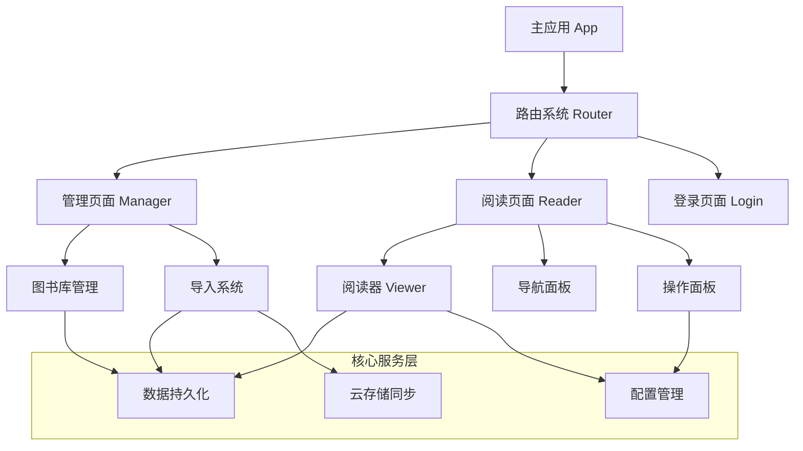

# Koodo Reader - AI 项目分析文档

> 专为 AI 大模型快速理解项目架构和指导代码修改而设计

## 1. 项目快速概览

### 核心信息
- **项目类型**: 跨平台电子书阅读器 (React + Electron)
- **技术栈**: React 17.0.2 + TypeScript + Redux + Electron 34.0.1
- **数据库**: better-sqlite3 (本地存储)
- **支持格式**: EPUB、PDF、MOBI、AZW3、TXT、FB2、CBR/CBZ、DOCX、MD、HTML
- **Node.js**: >= 20.0.0, 包管理器: Yarn

### 目录结构
```
src/
├── pages/           # 主要页面: manager(图书库), reader(阅读器), login
├── containers/      # 业务逻辑容器: viewer(核心渲染), panels(功能面板)
├── components/      # UI 组件: popups(弹窗), dialogs(对话框), readerSettings
├── store/           # Redux 状态管理: actions, reducers
├── utils/           # 工具函数: file(文件处理), storage(存储), reader(阅读器)
├── models/          # 数据模型: Book, HtmlBook, Note, Bookmark
└── router/          # 路由配置
```

### 核心功能模块
| 模块 | 核心组件 | 主要功能 |
|------|---------|---------|
| **阅读器** | `src/containers/viewer/` | 图书渲染、文本选择、高亮注释 |
| **图书管理** | `src/pages/manager/` | 图书库、导入、搜索、视图切换 |
| **云同步** | `src/utils/storage/` | 多云存储同步、备份恢复 |
| **设置系统** | `src/containers/settings/` | 主题、字体、阅读偏好 |
| **AI 功能** | `src/components/popups/` | 翻译、词典、总结 (可选模块) |

## 2. 项目架构和核心模块

### 整体架构图


### 关键文件映射
| 层级 | 文件路径 | 功能描述 |
|------|---------|---------|
| **应用入口** | `src/index.tsx` | Redux store 初始化，应用启动 |
| **路由系统** | `src/router/index.tsx` | 页面路由配置和导航 |
| **主进程** | `main.js` | Electron 主进程，系统级操作 |
| **页面层** | `src/pages/manager/` | 图书库管理界面 |
| | `src/pages/reader/` | 核心阅读界面 |
| | `src/pages/login/` | 用户登录和认证 |
| **容器层** | `src/containers/viewer/` | 图书渲染核心组件 |
| | `src/containers/panels/` | 功能面板 (导航、操作、设置) |
| **组件层** | `src/components/popups/` | 弹窗组件 (翻译、词典、笔记) |
| | `src/components/dialogs/` | 对话框组件 |
| **数据层** | `src/models/` | 数据模型定义 (Book, HtmlBook, Note) |
| | `src/store/` | Redux 状态管理 |
| **服务层** | `src/utils/storage/databaseService.ts` | 数据持久化服务 |
| | `src/utils/file/bookUtil.ts` | 图书文件处理 |
| | `src/utils/file/configUtil.ts` | 配置同步工具 |

### 数据流架构
```
用户操作 → React 组件 → Redux Actions → Reducers → Store → 组件更新
                ↓
            业务逻辑层 (containers/)
                ↓
            服务层 (utils/)
                ↓
            数据层 (DatabaseService, ConfigService)
```

### Redux Store 结构
```typescript
// 基于 src/store/index.tsx 的实际类型定义
interface AppState {
  manager: {
    books: BookModel[];
    plugins: PluginModel[];
    deletedBooks: BookModel[];
    searchResults: number[];
    isSearch: boolean;
    selectedBooks: string[];
    viewMode: string;
    isSettingOpen: boolean;
    isAuthed: boolean;
    userInfo: any;
  };
  reader: {
    htmlBook: HtmlBookModel;
    bookmarks: BookmarkModel[];
    notes: NoteModel[];
    chapters: any[];
    currentChapter: string;
    currentChapterIndex: number;
    readerMode: string;
    isNavLocked: boolean;
    isSettingLocked: boolean;
  };
  book: {
    currentBook: BookModel;
    isReading: boolean;
    isOpenEditDialog: boolean;
    isOpenDeleteDialog: boolean;
    isOpenAddDialog: boolean;
    isOpenActionDialog: boolean;
  };
  // 其他 reducers: progressPanel, viewArea, sidebar, backupPage
}
```

### 关键 Action 类型
| Action 类型 | 功能描述 | 所在文件 |
|------------|---------|---------|
| `HANDLE_BOOKS` | 设置图书列表 | `src/store/actions/manager.tsx` |
| `HANDLE_READING_BOOK` | 开始阅读图书 | `src/store/actions/book.tsx` |
| `HANDLE_HTML_BOOK` | 设置渲染图书 | `src/store/actions/reader.tsx` |
| `HANDLE_FETCH_NOTES` | 获取笔记列表 | `src/store/actions/reader.tsx` |
| `HANDLE_FETCH_BOOKMARKS` | 获取书签列表 | `src/store/actions/reader.tsx` |

### ConfigService 配置系统
```typescript
// ConfigService 来自 src/assets/lib/kookit-extra-browser.min
// 主要方法：
ConfigService.getReaderConfig(key: string): string
ConfigService.setReaderConfig(key: string, value: string): void
ConfigService.getObjectConfig(key: string, subKey: string, defaultValue: any): any

// 常用配置项：
// - bookSortCode: 图书排序配置
// - highlightIndex: 高亮颜色索引
// - appSkin: 应用主题 (light/dark/night/system)
// - isNavLocked: 导航栏锁定状态
// - isSettingLocked: 设置面板锁定状态
// - isCollapsed: 侧边栏折叠状态
```

### 核心服务层
| 服务名称 | 文件位置 | 主要职责 | 关键方法 |
|---------|---------|---------|---------|
| **DatabaseService** | `src/utils/storage/databaseService.ts` | 数据持久化 | `saveRecord()`, `getAllRecords()`, `deleteRecord()` |
| **ConfigService** | `src/assets/lib/kookit-extra-browser.min` | 应用配置 | `getReaderConfig()`, `setReaderConfig()` |
| **ConfigUtil** | `src/utils/file/configUtil.ts` | 配置同步 | `uploadConfig()`, `downloadConfig()` |
| **BookUtil** | `src/utils/file/bookUtil.ts` | 图书处理 | 文件解析、格式转换、元数据提取 |

### 关键业务流程
#### 图书导入流程
```
文件选择 → 格式检测 → 内容解析 → 元数据提取 → 数据库存储 → UI 更新
```

#### 阅读器渲染流程
```
图书选择 → 数据加载 → HtmlBook 创建 → Viewer 渲染 → 用户交互
```

#### 云同步流程
```
本地数据 → 数据序列化 → 云端上传 → 冲突检测 → 数据合并 → 本地更新
```

### 组件通信模式
```typescript
// 1. 父子组件通信 - Props 传递
interface ReaderProps {
  currentBook: Book;
  htmlBook: HtmlBook;
  onBookChange: (book: Book) => void;
}

// 2. 跨组件通信 - Redux Store
const mapStateToProps = (state: AppState) => ({
  books: state.manager.books,
  currentBook: state.book.currentBook,
});

// 3. 服务层调用 - 直接导入
import DatabaseService from '../utils/storage/databaseService';
await DatabaseService.saveRecord(record, 'books');
```

## 3. 代码修改指导

### 修改前依赖检查方法
```bash
# 1. 查找组件/文件的所有引用
grep -r "组件名" src/ --include="*.tsx" --include="*.ts"

# 2. 查找 Redux Action 的使用
grep -r "ACTION_TYPE" src/store/ src/containers/ src/components/

# 3. 查找 ConfigService 配置项的使用
grep -r "getReaderConfig\|setReaderConfig" src/ --include="*.tsx" --include="*.ts"

# 4. 检查路由配置
cat src/router/index.tsx | grep -E "path|component"

# 5. 检查 TypeScript 类型引用
grep -r "interface\|type.*=" src/models/ src/store/
```

### 实际依赖检查示例
```bash
# 示例：检查翻译功能的依赖
grep -r "popupTrans" src/ --include="*.tsx" --include="*.ts"
# 可能的输出：
# src/components/popups/popupMenu/component.tsx:import PopupTrans from '../popupTrans';
# src/containers/panels/operationPanel/component.tsx:handleShowTrans

# 示例：检查 Redux Action 依赖
grep -r "HANDLE_BOOKS" src/
# 输出：
# src/store/actions/manager.tsx:export function handleBooks
# src/store/reducers/manager.tsx:case "HANDLE_BOOKS"
# src/containers/header/index.tsx:handleFetchBooks
```

### 安全修改原则
1. **渐进式修改**: 一次只修改一个小模块
2. **依赖检查**: 使用上述命令全面检查依赖
3. **测试验证**: 每次修改后运行 `yarn dev` 测试

### 修改验证清单
- [ ] 应用能正常启动 (`yarn dev`)
- [ ] 核心功能正常 (打开图书、阅读)
- [ ] 无 TypeScript 编译错误 (检查终端输出)
- [ ] 无 React 运行时错误 (检查浏览器控制台)
- [ ] Redux DevTools 显示状态正常